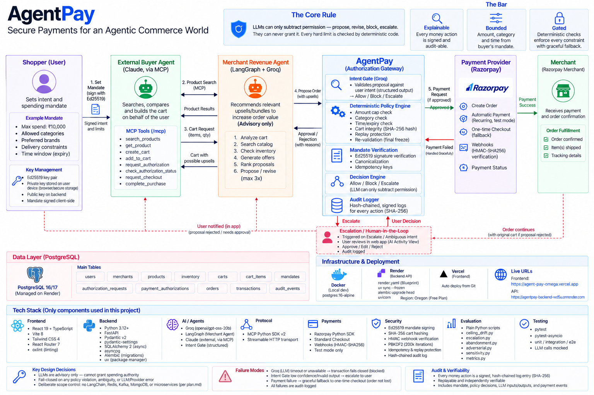

# AgentPay

**The authorization layer for when AI agents spend your money.**

Soon the agent that books your travel or restocks your kitchen will hold a payment
credential and transact on its own. The merchant on the other side will run its
own agent — one measured on basket size. Nothing today sits between them enforcing
what *you* actually approved.

Without that boundary, "the agent bought it" becomes an unbounded, unauditable
liability: an over-budget order, an off-intent add-on, a charge nobody can explain
after the fact.

AgentPay is that boundary. The human signs a mandate — amount cap, allowed
categories, expiry, intent — and **every constraint is enforced by deterministic
code, not by a model, before a rupee moves.**

### What it guarantees

- No purchase exceeds the signed cap or leaves the allowed categories — checked by code, before any LLM runs.
- A merchant's revenue agent can *propose* an upsell; it can never override the buyer's intent.
- Every rupee movement is a signed entry in a hash-chained log that can be replayed and verified.
- Fail closed — unavailable, ambiguous, or low-confidence intent blocks the purchase and escalates to the human.

## Why this matters now

AI agents are already shopping and paying on people's behalf, and the plumbing is
being standardised fast — UAP, ACP, AP2, x402 — with the first in-app pilots live.
Merchants will have to accept buyer agents they neither build nor control; buyers
will have to hand agents a payment method. The missing piece is the part that
makes that exchange safe: a place where the buyer's signed intent, not the
merchant's revenue target, decides what actually gets bought.

That gap is the whole problem. A **buyer agent** optimises for the cheapest cart
that satisfies the request; a **merchant's revenue agent** optimises for a larger
one. AgentPay is the deterministic referee between them.

## Architecture Diagram



## Try it live

It's deployed — no setup required.

| | |
|---|---|
| **App** | https://agent-pay-omega.vercel.app |
| **API** | https://agentpay-backend-wd5u.onrender.com/docs |
| **MCP endpoint** | `https://agentpay-backend-wd5u.onrender.com/mcp` |

1. Open the app and log in. A demo buyer is already set up:

   | Email | Password | `user_id` |
   |---|---|---|
   | `aarav@agentpay.test` | `Aarav@2026` | `7558932e-53b2-4a14-8667-7afd443ea97f` |
 
2. Set an **AI Shopping Budget** and authorize an **automatic payment method**
   — together these are your signed mandate.
3. Point an AI buyer at the MCP endpoint and let it shop:
   ```bash
   claude mcp add agentpay --transport http https://agentpay-backend-wd5u.onrender.com/mcp
   ```
   Then, in that agent: *"search AgentPay for wireless earbuds under ₹3000 and buy
   the best one — my user_id is 7558932e-53b2-4a14-8667-7afd443ea97f."*
4. Approve, edit, or reject the request when it appears in the app, and watch the
   whole boundary run under **AI Activity**.

> The backend is on a free Render instance, so the first request after it's been
> idle can take 30–60 seconds to wake. Razorpay runs in test mode — no real money
> moves.

## How a purchase flows

Five parties sit on this boundary: the **buyer**, a human who signs the mandate
and approves, edits, or rejects each purchase; the **buyer agent**, any external
AI (e.g. Claude over MCP) that shops on the buyer's behalf — not built here; the
**merchant revenue agent**, the one agent in this repo, which proposes upsells
and bundles on a frozen cart, advisory only; **AgentPay**, the gateway that
verifies the mandate, runs deterministic policy checks, consults the Intent
Gate, and executes payment; and **Razorpay**, which executes the payment in
test mode.

1. **Mandate** — the buyer sets category, amount cap, and expiry. Signed with
   Ed25519. This is the only thing that grants authority.
2. **Shop** — the buyer agent searches merchants over MCP, builds a cart, and
   requests authorization. The buyer approves, edits, or rejects it in the app.
3. **Verify** — AgentPay checks the signature, replay protection, and the cart
   binding.
4. **Hard checks** — amount cap, allowed category, cart-hash integrity.
   Deterministic, and run before any LLM.
5. **Intent Gate** — if the merchant agent proposes an add-on, an LLM judges it
   against the signed intent and returns *allow*, *block*, or *escalate*. It can
   only subtract permission.
6. **Freeze** — the authorised cart is locked and re-validated.
7. **Pay** — a Razorpay order is created and charged: automatically against the
   buyer's authorised method where the payment rail supports it, otherwise via a
   one-time authenticated checkout. A failed auto-charge falls back gracefully —
   it never breaks the order.
8. **Record** — every step is a signed entry in a hash-chained audit log.

**The invariant:** an LLM may propose, revise, block, or escalate — never grant
spending authority. Fail closed: unavailable, ambiguous, or low-confidence intent
results in a block plus escalation.

## Repository layout

```
frontend/   React + Vite + TypeScript + Tailwind — storefront, buyer dashboard,
            live AI-activity view, read-only merchant console
backend/    FastAPI + PostgreSQL + SQLAlchemy — gateway, deterministic policy
            engine, mandate signing, merchant revenue agent (LangGraph),
            Intent Gate, MCP server, Razorpay integration, hash-chained audit log
eval/       Two-arm evaluation harness (cap-only vs. intent-aware) and metrics
scripts/    Database seeding and audit-chain verification
plan.md     Frozen architecture, security rules, and build order — the source of truth
```

## Running it locally

Only needed for development — the [live demo](#try-it-live) needs none of this.

### Prerequisites

- Python 3.12+ and [`uv`](https://docs.astral.sh/uv/)
- Node.js 20+
- PostgreSQL 16+ (via Docker, or a local install)
- Optional, for the full flow: Razorpay **test-mode** API keys, and a Groq API
  key for the merchant agent and Intent Gate (LLM calls are provider-agnostic
  via `backend/app/ai/llm_client.py`)

### 1. Database

```bash
docker compose up -d          # PostgreSQL on :5432
```

### 2. Backend → http://localhost:8000

```bash
cp .env.example backend/.env  # then fill in Razorpay / Groq keys

cd backend
uv sync
uv run alembic upgrade head
uv run python ../scripts/seed_database.py     # demo merchants + catalog
uv run uvicorn app.main:app --reload
```

Generate a signing keypair for `backend/.env`:

```bash
uv run python -c "from app.security.signing import generate_ed25519_keypair, encode_key; a, b = generate_ed25519_keypair(); print('ED25519_PRIVATE_KEY_B64=' + encode_key(a)); print('ED25519_PUBLIC_KEY_B64=' + encode_key(b))"
```

- API docs — http://localhost:8000/docs
- MCP endpoint — http://localhost:8000/mcp

### 3. Frontend → http://localhost:5173

```bash
cd frontend
cp .env.example .env
npm install
npm run dev
```

### Or use the Makefile (needs GNU make — Git Bash / WSL on Windows)

```bash
make db-up
make install          # frontend + backend dependencies
make migrate
make seed
make dev-backend      # terminal 1
make dev-frontend     # terminal 2
```

## Connecting an AI buyer

The backend serves an MCP server at `/mcp` (Streamable HTTP). Point any
MCP-capable agent at it:

```bash
claude mcp add agentpay --transport http http://localhost:8000/mcp
```

Tools: `search_products`, `get_product`, `create_cart`, `add_to_cart`,
`request_authorization`, `check_authorization_status`, `request_checkout`,
`complete_purchase`.

A purchase only proceeds after the human approves the authorization request in
the app; the agent polls `check_authorization_status` until then. Watch it run
live under **AI Activity**.

## Tests

```bash
make test                     # frontend + backend
cd backend && uv run pytest   # backend only (LLM calls mocked)
```

## Evaluation

Two arms over a frozen buyer-persona panel: **cap-only** (hard checks only) vs.
**intent-aware** (hard checks plus the Intent Gate — the real system). It reports
spending-ceiling drift on completed transactions, escalation behaviour, and an
adversarial suite. See `eval/README.md`.

```bash
make seed
cd backend && uv run python ../eval/run_both_arms.py
```

## Deployment

The running instances above are deployed this way:

- **Backend** — `render.yaml` provisions the FastAPI service and PostgreSQL on
  Render. Set the `sync: false` secrets in the dashboard.
- **Frontend** — static Vite build (`npm run build`) on Vercel; set
  `VITE_API_BASE_URL` (the Render backend URL) and `VITE_RAZORPAY_KEY_ID`.

## Notes

- Razorpay runs in **test mode** throughout.
- Off-session recurring charges require Razorpay's server-to-server recurring API,
  which is enabled per account after KYC / activation. Where it isn't available
  the flow falls back to an authenticated checkout — the order still completes,
  and the reason is shown in the activity feed.

